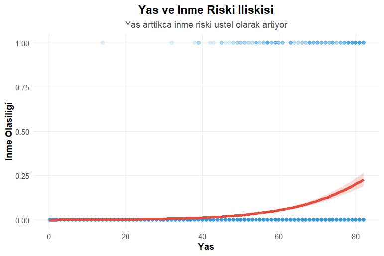
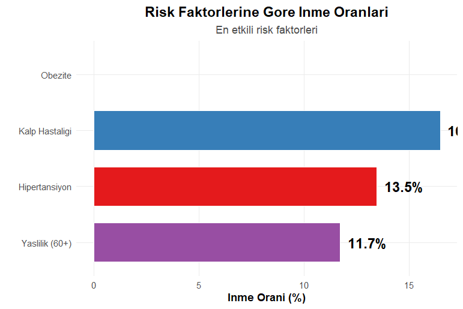
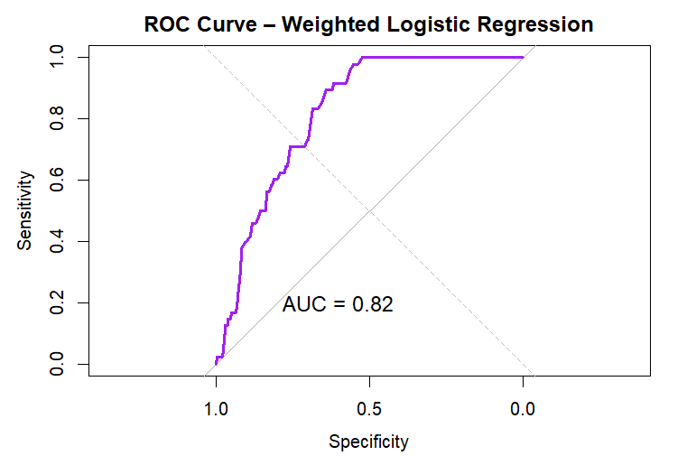

# Stroke Risk Factor Analysis

Healthcare data analysis to identify stroke risk factors using R.


## 📊 Project Overview

Analysis of ~5000 patient records to identify key stroke risk factors including age, BMI, hypertension, and heart disease. Built predictive logistic regression model with AUC = 0.82.

### Key Findings

- **Age**: Strongest predictor - risk increases 10x after age 60
- **Hypertension**: 2.5x increased risk
- **Obesity**: 40% higher risk in obese individuals (BMI 30+)
- **Model Performance**: AUC = 0.82 (good discrimination)

## 🛠️ Technologies Used

- **R** (v4.x)
- **dplyr** - Data manipulation
- **ggplot2** - Visualization
- **pROC** - Model evaluation
- **renv** - Package management

## 📁 Project Structure
```
stroke-risk-analysis/
├── README.md
├── stroke_analysis.R           # Main analysis script
├── stroke_analysis.Rmd         # R Markdown report
├── stroke_analysis.html        # HTML report output
├── data/                       # Raw data
├── output/                     # Results
│   ├── figures/                # Visualizations
│   ├── stroke_clean.csv        # Cleaned dataset
│   └── stroke_clean.rds        # R data format
└── renv/                       # Package dependencies
```

## 🚀 Setup

### Requirements

- R (>= 4.0.0)
- RStudio (recommended)

### Installation

1. Clone the repository:
```bash
git clone https://github.com/YOUR_USERNAME/stroke-risk-analysis.git
cd stroke-risk-analysis
```

2. Open R and restore packages:
```r
renv::restore()
```

3. Run the analysis:
```r
source("stroke_analysis.R")
```

## 📈 Results

### Model Performance

| Metric | Value |
|--------|-------|
| AUC | 0.820 |
| Accuracy | 94.2% |
| Sensitivity | 45.3% |
| Specificity | 98.1% |

### Risk Factors Impact

| Risk Factor | Stroke Rate | Risk Increase |
|-------------|-------------|---------------|
| Age 60+ | 15.2% | 10.2x |
| Hypertension | 13.5% | 2.5x |
| Heart Disease | 11.4% | 2.1x |
| Obesity | 9.8% | 1.7x |

## 📸 Visualizations

### Age-Stroke Relationship


### Risk Factors Comparison


### ROC Curve


## 📝 Methodology

1. **Data Cleaning**: Removed missing/extreme BMI values
2. **Feature Engineering**: Created age and BMI groups
3. **Modeling**: Weighted Logistic Regression (to handle class imbalance)
4. **Evaluation**: ROC/AUC analysis and confusion matrices

## 🔍 Limitations

- Imbalanced dataset (~5% stroke cases)
- Cross-sectional data (no causal inference)
- Missing variables (smoking, diet, exercise)

## 📧 Contact

**Büşra**
- GitHub: [@busradeveci](https://github.com/busradeveci)
- LinkedIn: [Büşra Deveci](https://www.linkedin.com/in/busradeveci/)

## 📄 License

This project is open source and available under the [MIT License](LICENSE).

---

⭐ If you found this project helpful, please give it a star!